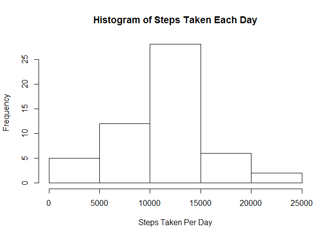

This is the code chunk for reading data

``` r
activity <- read.csv(file = "activity.csv", header = T, stringsAsFactors = F)
```

What is mean total number of steps taken per day? (Ignore the missing values) 1. Calculate the total number of steps taken per day?

``` r
activity_1 <- activity[!is.na(activity$steps),]
steps_by_date <- aggregate(steps~date, data=activity_1, FUN = sum)
```

1.  Make a histogram of steps taken each day

``` r
hist(steps_by_date$steps, main = "Histogram of Steps Taken Each Day", 
     xlab = "Steps Taken Per Day", ylab=" Frequency")
```



1.  Calculate and report mean and median of the total number of steps taken each day?

``` r
aggregate <- data.frame(mean=mean(steps_by_date$steps), median=median(steps_by_date$steps))
aggregate
```

    ##       mean median
    ## 1 10766.19  10765

What is the average daily activity pattern 1. Make a time series plot (i.e. type = "l") of the 5-minute interval (x-axis) and the average number of steps taken, averaged across all days (y-axis)

``` r
steps_by_interval <- aggregate(steps~interval, data=activity_1, FUN = mean)
plot(steps_by_interval$interval, steps_by_interval$steps, type = "l", xlab="5 minutes interval",
     ylab = "average steps taken across all days")
```


1.  Which 5-minute interval, on average across all the days in the dataset, contains the maximum number of steps?

``` r
steps_by_interval[which.max(steps_by_interval$steps),]
```

    ##     interval    steps
    ## 104      835 206.1698

The 835 interval on average contains the maximum number of steps

Imputing Missing Values 1. Calculate and report the total number of missing values in the dataset (i.e. the total number of rows with NAs)

``` r
sum(is.na(activity))
```

    ## [1] 2304

There are 2304 missing values in the dataset

1.  Devise a strategy for filling in all of the missing values in the dataset. The strategy does not need to be sophisticated. For example, you could use the mean/median for that day, or the mean for that 5-minute interval, etc.

My strategy is to replace NA values with the mean of the interval

1.  Create a new dataset that is equal to the original dataset but with the missing data filled in (newactivity)

``` r
newactivity <- activity
for(i in 1:17568){
        if(is.na(newactivity$steps[i])){
                newactivity$steps[i] <- steps_by_interval$steps[which(newactivity$interval[i]==steps_by_interval$interval)]
        }
}
```

1.  Make a histogram of the total number of steps taken each day and Calculate and report the mean and median total number of steps taken per day. Do these values differ from the estimates from the first part of the assignment? What is the impact of imputing missing data on the estimates of the total daily number of steps?

``` r
newstep_by_date <- aggregate(steps~date, data =  newactivity, FUN = sum)
hist(newstep_by_date$steps, col=rgb(0,0,1,1/4), main = "Histogram of Steps Taken Each Day", 
     xlab = "Steps Taken Per Day", ylab=" Frequency")
hist(steps_by_date$steps, col=rgb(1,0,0,1/4), main = "Histogram of Steps Taken Each Day", 
     xlab = "Steps Taken Per Day", ylab=" Frequency", add=T, ylim=c(0,35))
```


After imputing missing values, there are more days falling within 10000 to 15000 range.

Are there differences in activity patterns between weekdays and weekends? Create a new factor variable in the dataset with two levels - "weekday" and "weekend" indicating whether a given date is a weekday or weekend day.

``` r
weekdays1 <- c("MOnday", "Tuesday", "Wednesday", "Thursday", "Friday")
newactivity$weekdays <- factor(weekdays(as.Date(newactivity$date))%in%weekdays1, 
                               levels = c(FALSE, TRUE), labels =         
                                       c("weekend","weekday"))
```

Make a panel plot containing a time series plot (i.e. type = "l") of the 5-minute interval (x-axis) and the average number of steps taken, averaged across all weekday days or weekend days (y-axis). See the README file in the GitHub repository to see an example of what this plot should look like using simulated data.

``` r
newactivity_interval <- aggregate(steps~interval+weekdays, data=newactivity, FUN = mean)
library(ggplot2)
qplot(x = interval, y = steps, data = newactivity_interval, facets = weekdays~., geom=c("line"))
```


There are more steps taken when people are travelling to work on weekdays and steps taken are more spreaded over time at weekends.
